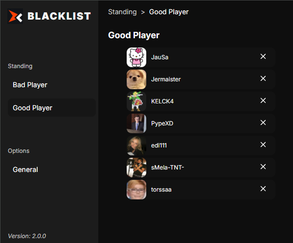
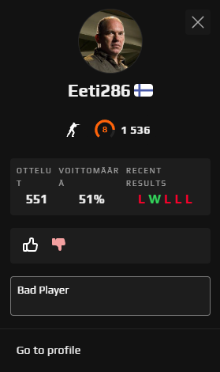
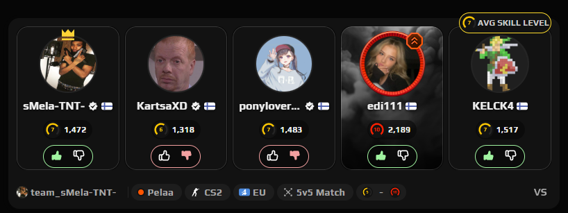

<div align="left" style="position: relative;">
<h1>FACEIT BLACKLIST BROWSER EXTENSION</h1>
<p align="left">
	
	
	
	
</p>
<p align="left">Built with the tools and technologies:</p>
<p align="left">
	
	
	
	
	
</p>
</div>
<br clear="right">

<details><summary>Table of Contents</summary>

- [ Overview](#-overview)
- [ Features](#-features)
- [ Project Structure](#-project-structure)
  - [ Project Index](#-project-index)
- [ Getting Started](#-getting-started)
  - [ Prerequisites](#-prerequisites)
  - [ Installation](#-installation)
  - [ Usage](#-usage)
  - [ Testing](#-testing)
- [ Project Roadmap](#-project-roadmap)
- [ Contributing](#-contributing)
- [ License](#-license)
- [ Acknowledgments](#-acknowledgments)

</details>
<hr>

##  Overview

<code>With this extension user can mark players as bad or good in Faceit.com</code>





---


##  Project Structure

```sh
└── Faceit-blacklist-browser-extension/
    ├── package-lock.json
    ├── package.json
    ├── public
    │   └── icon
    ├── src
    │   ├── background.js
    │   ├── content
    │   ├── manifest.json
    │   ├── pages
    │   ├── popup.css
    │   ├── popup.html
    │   ├── popup.jsx
    │   └── shared
    └── vite.config.js
```


###  Project Index
<details open>
	<summary><b><code>FACEIT-BLACKLIST-BROWSER-EXTENSION/</code></b></summary>
	<details> <!-- __root__ Submodule -->
		<summary><b>__root__</b></summary>
		<blockquote>
			<table>
			<tr>
				<td><b><a href='https://github.com/Eeti286/Faceit-blacklist-browser-extension/blob/master/package-lock.json'>package-lock.json</a></b></td>
			</tr>
			<tr>
				<td><b><a href='https://github.com/Eeti286/Faceit-blacklist-browser-extension/blob/master/vite.config.js'>vite.config.js</a></b></td>
			</tr>
			<tr>
				<td><b><a href='https://github.com/Eeti286/Faceit-blacklist-browser-extension/blob/master/package.json'>package.json</a></b></td>
			</tr>
			</table>
		</blockquote>
	</details>
	<details> <!-- src Submodule -->
		<summary><b>src</b></summary>
		<blockquote>
			<table>
			<tr>
				<td><b><a href='https://github.com/Eeti286/Faceit-blacklist-browser-extension/blob/master/src/popup.jsx'>popup.jsx</a></b></td>
			</tr>
			<tr>
				<td><b><a href='https://github.com/Eeti286/Faceit-blacklist-browser-extension/blob/master/src/popup.html'>popup.html</a></b></td>
			</tr>
			<tr>
				<td><b><a href='https://github.com/Eeti286/Faceit-blacklist-browser-extension/blob/master/src/background.js'>background.js</a></b></td>
			</tr>
			<tr>
				<td><b><a href='https://github.com/Eeti286/Faceit-blacklist-browser-extension/blob/master/src/manifest.json'>manifest.json</a></b></td>
			</tr>
			<tr>
				<td><b><a href='https://github.com/Eeti286/Faceit-blacklist-browser-extension/blob/master/src/popup.css'>popup.css</a></b></td>
			</tr>
			</table>
			<details>
				<summary><b>shared</b></summary>
				<blockquote>
					<table>
					<tr>
						<td><b><a href='https://github.com/Eeti286/Faceit-blacklist-browser-extension/blob/master/src/shared/storage.js'>storage.js</a></b></td>
					</tr>
					</table>
				</blockquote>
			</details>
			<details>
				<blockquote>
					<table>
					<tr>
						<td><b><a href='https://github.com/Eeti286/Faceit-blacklist-browser-extension/blob/master/src/content/content.js'>content.js</a></b></td>
					</tr>
					<tr>
						<td><b><a href='https://github.com/Eeti286/Faceit-blacklist-browser-extension/blob/master/src/content/styles.css'>styles.css</a></b></td>
					</tr>
					</table>
				</blockquote>
			</details>
			<details>
				<summary><b>pages</b></summary>
				<blockquote>
					<table>
					<tr>
						<td><b><a href='https://github.com/Eeti286/Faceit-blacklist-browser-extension/blob/master/src/pages/indexStyle.css'>indexStyle.css</a></b></td>
					</tr>
					<tr>
						<td><b><a href='https://github.com/Eeti286/Faceit-blacklist-browser-extension/blob/master/src/pages/Popup.jsx'>Popup.jsx</a></b></td>
					</tr>
					</table>
				</blockquote>
			</details>
		</blockquote>
	</details>
</details>

---
##  Getting Started

###  Prerequisites

Before getting started with Faceit-blacklist-browser-extension, ensure your runtime environment meets the following requirements:

- **Programming Language:** JavaScript
- **Package Manager:** Npm


###  Installation

Install Faceit-blacklist-browser-extension using one of the following methods:

**Build from source:**

1. Clone the Faceit-blacklist-browser-extension repository:
```sh
❯ git clone https://github.com/Eeti286/Faceit-blacklist-browser-extension
```

2. Navigate to the project directory:
```sh
❯ cd Faceit-blacklist-browser-extension
```

3. Install the project dependencies:


**Using `npm`** &nbsp; [](https://www.npmjs.com/)

```sh
❯ npm install
```


###  Build
Run Faceit-blacklist-browser-extension using the following command:
**Using `npm`** &nbsp; [](https://www.npmjs.com/)

```sh
❯ npm run build
```


###  Usage
Add `/dist` folder to chrome web browser at extension section:


---

##  License

This project is protected under the [MIT License] License. For more details, refer to the [MIT License](https://choosealicense.com/licenses/mit) file.

---
